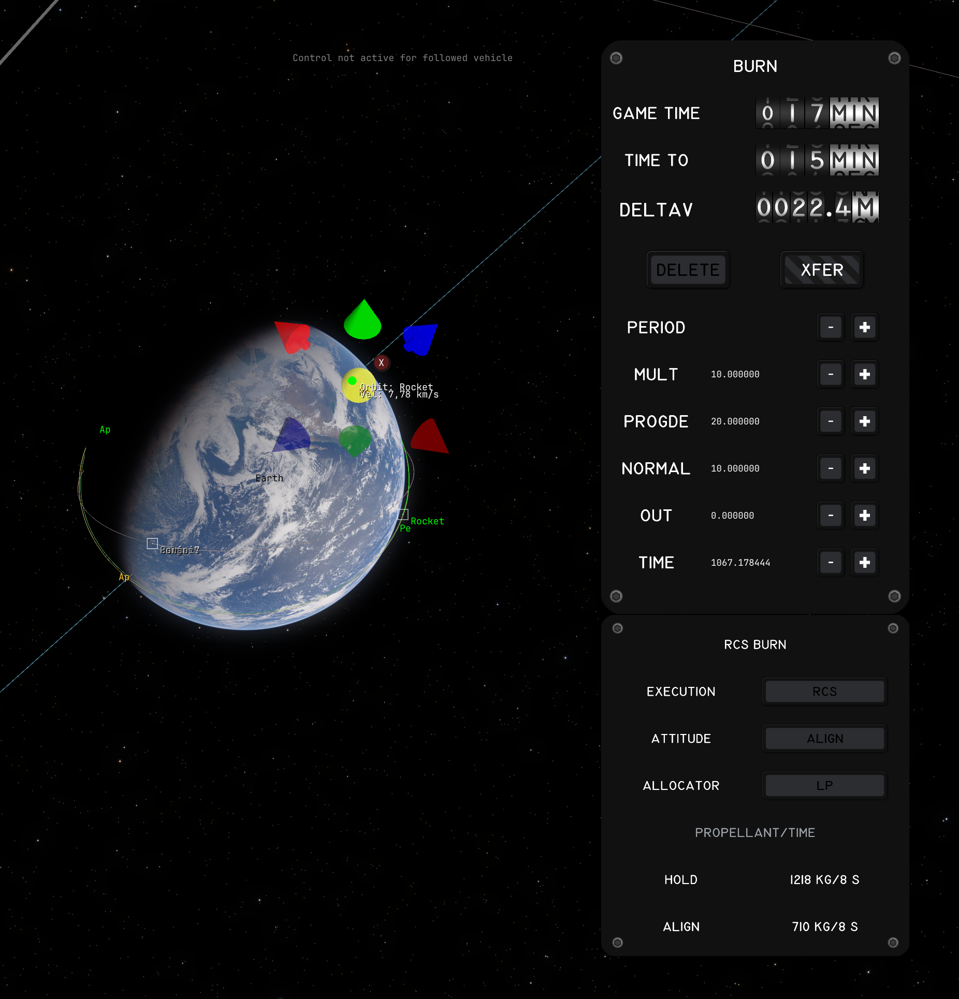

# AdvancedFlightComputer [](https://opensource.org/licenses/MIT)

Extra maneuver planning tools for [Kitten Space Agency](https://ahwoo.com/app/100000/kitten-space-agency).

Adds quick-tools to the Transfer Planner (set Pe/Ap, match/set inclination, circularize), flyby targeting so a Hohmann transfer arrives as a flyby instead of an impact, multi-pass burn splitting for Oberth-efficient departures, and enables the planner to target interstellar comets on hyperbolic orbits (Oumuamua, 2I/Borisov, 3I/ATLAS).

This mod is written against the [StarMap loader](https://github.com/StarMapLoader/StarMap).

Validated against KSA build version 2026.9.7.5402.

## Features

### Maneuver Quick-Tools

New plan types in the stock Transfer Planner dropdown:

- **Set Periapsis / Set Apoapsis** - single burn at the opposite apse to raise or lower one apse to a target altitude.
- **Match Inclination** - plane-change burn at AN or DN to align with a target orbit's plane.
- **Set Inclination** - plane-change burn at AN or DN to set an absolute inclination angle. The reference plane is selectable: **Ecliptic** (matches `Orbit.Inclination`, KSA's system-wide inertial Z) or **Equatorial** (parent body's equator, standard astrodynamics convention). For Earth the two differ by the ~23.4 degree obliquity.

Right-click the controlled vehicle's orbit and open **Advanced Flight Computer** to select a quick-tool.
The **At Periapsis** submenu offers **AFC: Set Apoapsis...**, and **At Apoapsis** offers **AFC: Set Periapsis...**.
These shortcuts open the planner and they do not place a burn at the clicked point.

Quick-tools can plan a single burn after the last planned burn that changes the trajectory.
For example, plan a burn to raise apoapsis, then use **Set Periapsis** on the resulting orbit.
The preview and created node use that post-burn trajectory.
Multi-pass cannot start on a pending burn's trajectory.
Shortcuts wait until a stock transfer calculation or active multi-pass execution has finished.

### Flyby Targeting

The stock planner aims every transfer at the target body's center, so a well-timed Hohmann arrives as an impact and the flyby has to be set up afterwards as a separate correction. Tick **Target flyby periapsis** in the Transfer Planning window and the departure burn is aimed to arrive at a periapsis you choose instead, so **Create** fires the flyby directly.

- **Periapsis** is entered against a selectable reference: **Surface** (altitude above the mean radius), **Center** (radius straight from the body center), or **Atmosphere** (altitude above the atmosphere boundary). The Atmosphere option only appears for bodies that have one, and a request below the safe floor is refused.
- **Flyby side** picks which side of the body you pass, named in the target's own orbital frame: **Inner** (toward its parent), **Outer** (away from it), **North**, or **South**. The aim offset has to stay perpendicular to the approach, so a side whose axis lies along the approach direction cannot be reached and is greyed out. That is also why there is no leading/trailing option for a Hohmann-style arrival.
- Works for moon flybys and for interplanetary targets, either as a single burn or split across multi-pass passes.
- The section reports the approach speed, the impact parameter, the departure delta-V next to the impact-aimed one, and the periapsis the propagated trajectory actually reaches. While a flyby is armed the preview shows that retargeted trajectory in place of stock's center-aimed one.
- For multiple passes, the readout uses the selected departure after any schedule shift and the periapsis from the final preview trajectory.
- If propagation cannot confirm a periapsis, the readout shows **No prediction** and its reason, such as a departure time outside the flight plan or no resolved target encounter.

**Limitations:**
- The plan is impulsive, the burn is not. On a near-escape departure the apoapsis moves by thousands of km per m/s of periapsis velocity, so the periapsis actually flown drifts from the requested one by roughly the finite-burn loss (order of one percent of a multi-km/s injection). Expect to trim it with a small correction burn, or split the departure across several passes to cut the loss.

### Multi-Pass Burns


Any of the above plan types (including stock Hohmann and circularize Apse transfers) can be split into multiple burns across successive orbits.
Instead of one long burn that sweeps a large arc away from periapsis, the engine fires in shorter bursts near periapsis on each orbit, reducing finite-burn loss.

**Supported plan types that can be split:**
- Hohmann transfers
- Set Periapsis / Set Apoapsis
- Match Inclination / Set Inclination
- Circularize Apoapsis / Periapsis

**How to use:**
1. Select a plan type and configure the maneuver as usual.
2. Use the **PASSES** slider to choose how many passes (2-10).
3. Click **Create**. The first pass burn is placed in the burn plan.
4. Enable **Auto** burn mode. Each pass fires automatically, and the next pass is scheduled after completion.
5. The plan window shows "Multi-pass active: pass X of N" with remaining pass details and a **Cancel remaining passes** button.

**Why it helps:**
When burn duration is a significant fraction of the orbital period, a single burn wastes fuel by thrusting far from periapsis. Splitting across N passes keeps each burn near periapsis where the Oberth effect is strongest.
This is the same technique used by real missions: lunar kick stages that perform multiple perigee burns over several days to gradually raise their orbit before the final trans-lunar injection, because a single burn would spend too long thrusting away from periapsis. Particularly useful for low-TWR spacecraft (ion engines, small kick stages, nuclear tugs) where a single departure burn can take tens of minutes and sweep a large fraction of the orbit.

**Recommended companion mods:**
Multi-pass works best together with [AutoStage](https://github.com/Maximilian-Nesslauer/KSA-AutoStage) (handles staging between passes) and [AutoRemoveFinishedBurns](https://github.com/Maximilian-Nesslauer/KSA-AutoRemoveFinishedBurns) (cleans up completed burns automatically). With all three installed, a multi-pass execution runs hands-free from first ignition to final departure.

**Limitations:**
- Automatic pass advancement currently requires stock engine Auto mode. RCS translation completion does not advance the multi-pass sequence.
- Same-parent transfers (e.g., LEO to Luna) shift the final burn forward by a few parking periods to fit the K-schedule. The shift is shown in the plan window.
- A change to the flyby side or altitude updates the selected departure even during thrust.
- Very high-energy departures from small SOIs (e.g., low Mars orbit to Saturn) may auto-clamp to fewer passes because intermediate orbits would escape the SOI.

### RCS Translation Burns



Execute a planned burn with RCS thrusters only, no main engine. Useful for small correction burns (rotating the whole vehicle for the main engine can cost more than just translating) and for vehicles without an active main engine like small probes.

- The stock **Auto** burn button is still the single trigger: it executes the next burn with its resolved method. A burn resolves to the main engine when an active, fueled engine exists, otherwise to RCS; a per-burn override is available in the burn editor window ("Execution: Default | Engine | RCS").
- Two attitude strategies, selectable per burn: **Hold** (keep the current attitude, fire the axis mix that points at the burn vector) and **Align** (rotate the strongest thruster axis onto the burn vector first). **Auto** (default) compares propellant estimates for both, including the slew cost, and picks the cheaper one. The estimates derive from the bang-off-bang slew cost model standard in the attitude control literature.
- Execution is closed-loop against the game's own delta-V accounting: pulses shrink as the remaining delta-V approaches zero, and the burn stops inside the thrusters' minimum impulse of the target. The engine autopilot is suppressed for the whole run, so a misclick can never ignite the main engine on an RCS-armed burn.
- Burns themselves stay in the stock save format; removing the mod keeps every planned burn. The RCS arming metadata lives in `mods/AdvancedFlightComputer/rcs-exec.toml` next to the mod and survives save/load, including mid-burn.
- The burn editor warns when a burn resolves to RCS but no thruster can translate (no propellant, none active) and when the estimated propellant exceeds what the thrusters can actually reach. Auto also shows an alert and refuses the burn before it creates execution state or changes the controls when the burn has no delta-V, no usable translation, or no axis that can serve its direction.
- Estimates for a later planned burn use the current vehicle as an approximation and show **Estimate basis: Current vehicle** in the burn editor or **Current vehicle** in the gauge. Stock only loads the first executable burn as its active burn target, so these estimates do not forecast earlier burns or staging.
- Completed RCS burns raise a public event (`RcsBurnCompletions.Completed`) other mods can consume; [AutoRemoveFinishedBurns](https://github.com/Maximilian-Nesslauer/KSA-AutoRemoveFinishedBurns) uses it to clean up finished RCS burns the same way it cleans up engine auto-burns.
- The **allocator** is selectable per burn (default **Groups**). Groups fires signed-axis groups and uses attitude control to counter residual torque. **LP** solves a fuel-optimal jet-selection problem over individual thruster forces and torques (the Bergmann/Draper formulation). It prices residual torque on axes with rotation authority and requires zero net torque on the other axes. LP can require costly counter-thrust, so it is opt-in. It falls back to Groups when the constraints are infeasible.

### Hyperbolic Targets

The stock Transfer Planner filters out bodies with eccentricity >= 1. This mod lets it target interstellar comets (Oumuamua, 2I/Borisov, 3I/ATLAS) by patching the planner's time-of-flight and alignment math to handle unbound orbits.

## Installation

1. Install [StarMap](https://github.com/StarMapLoader/StarMap) and [KittenExtensions](https://github.com/tsholmes/KittenExtensions) (the latter is only required for hyperbolic targets).
2. Download the latest release from the [Releases](https://github.com/Maximilian-Nesslauer/KSA-AdvancedFlightComputer/releases) tab.
3. Extract into `Documents\My Games\Kitten Space Agency\mods\AdvancedFlightComputer\`.
4. The game auto-discovers new mods and prompts you to enable them. Alternatively, add to `Documents\My Games\Kitten Space Agency\manifest.toml`:

```toml
[[mods]]
id = "AdvancedFlightComputer"
enabled = true
```

## Dependencies

| Package | Purpose | Tested version |
| --- | --- | --- |
| [StarMap](https://github.com/StarMapLoader/StarMap) | Mod loader, required at runtime (see [Installation](#installation)) | 0.4.6 |
| [KittenExtensions](https://github.com/tsholmes/KittenExtensions) | Optional, required at runtime for the hyperbolic-targets XML patch | v0.4.0 |

## Build dependencies

Required only to build the mod from source. Targets **.NET 10**.

| Package | Source | Tested Version |
| --- | --- | --- |
| [StarMap.API](https://github.com/StarMapLoader/StarMap) | NuGet | 0.3.6 |
| [Lib.Harmony](https://www.nuget.org/packages/Lib.Harmony) | NuGet | 2.4.2 |

## Mod compatibility

- Known conflicts: none

## License

MIT — see [`LICENSE`](LICENSE). This applies to everything in the current tree.

The `PoweredGuidance/` subtree was merged in from
[cairn5/PoweredGuidance](https://github.com/cairn5/PoweredGuidance) with its full history
rather than as a squashed snapshot, so its commits stay reachable from this repo with
their original authorship intact.

PoweredGuidance releases up to and including **v0.3.1** linked
[ECOS](https://github.com/embotech/ecos), which is GPLv3, and were therefore distributed
under GPLv3 as a whole. Those commits remain reachable here and those releases stay
available under GPLv3 — a licence already granted cannot be withdrawn — but they are the
only versions to which that applies. ECOS was removed and replaced by Clarabel
(Apache-2.0) before the import, so **nothing in the current tree is GPL**.

Attribution for the vendored solvers and their own transitive dependencies is in
[`PoweredGuidance/THIRD-PARTY-NOTICES.md`](PoweredGuidance/THIRD-PARTY-NOTICES.md); all
of them are permissive, and none impose copyleft on this work.

## Community

Thread on the KSA forums: https://forums.ahwoo.com/threads/advanced-flight-computer.783/

## Check out my other mods

- [AutoStage](https://github.com/Maximilian-Nesslauer/KSA-AutoStage) - automatic staging during auto-burns and manual flight, with configurable ignition delays ([forum thread](https://forums.ahwoo.com/threads/autostage.891/))
- [MeasureTools](https://github.com/Maximilian-Nesslauer/KSA-MeasureTools) - click-to-measure ruler, protractor, and surface measuring in the map view ([forum thread](https://forums.ahwoo.com/threads/measuretools.992/))
- [AutoRemoveFinishedBurns](https://github.com/Maximilian-Nesslauer/KSA-AutoRemoveFinishedBurns) - automatically remove finished auto-burns from the burn plan ([forum thread](https://forums.ahwoo.com/threads/autoremovefinishedburns.928/))
