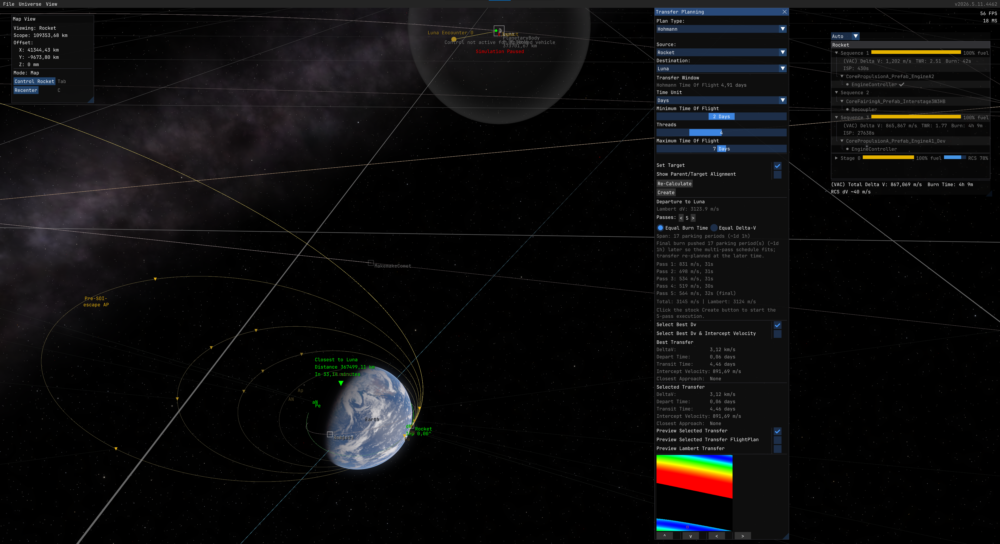

# AdvancedFlightComputer [](https://opensource.org/licenses/MIT)

Extra maneuver planning tools for [Kitten Space Agency](https://ahwoo.com/app/100000/kitten-space-agency).

Adds quick-tools to the Transfer Planner (set Pe/Ap, match/set inclination, circularize), multi-pass burn splitting for Oberth-efficient departures, and enables the planner to target interstellar comets on hyperbolic orbits (Oumuamua, 2I/Borisov, 3I/ATLAS).

This mod is written against the [StarMap loader](https://github.com/StarMapLoader/StarMap).

Validated against KSA build version 2026.6.6.4601.

## Features

### Maneuver Quick-Tools

New plan types in the stock Transfer Planner dropdown:

- **Set Periapsis / Set Apoapsis** - single burn at the opposite apse to raise or lower one apse to a target altitude.
- **Match Inclination** - plane-change burn at AN or DN to align with a target orbit's plane.
- **Set Inclination** - plane-change burn at AN or DN to set an absolute inclination angle. The reference plane is selectable: **Ecliptic** (matches `Orbit.Inclination`, KSA's system-wide inertial Z) or **Equatorial** (parent body's equator, standard astrodynamics convention). For Earth the two differ by the ~23.4 degree obliquity.

### Multi-Pass Burns



Any of the above plan types (including stock Hohmann and circularize Apse transfers) can be split into multiple burns across successive orbits.
Instead of one long burn that sweeps a large arc away from periapsis, the engine fires in shorter bursts near periapsis on each orbit, reducing finite-burn loss.

**Supported plan types that can be split:**
- Hohmann transfers
- Set Periapsis / Set Apoapsis
- Match Inclination / Set Inclination
- Circularize Apoapsis / Periapsis

**How to use:**
1. Select a plan type and configure the maneuver as usual.
2. Use the **< >** pass count selector to choose how many passes (2-10).
3. Click **Create**. The first pass burn is placed in the burn plan.
4. Enable **Auto** burn mode. Each pass fires automatically, and the next pass is scheduled after completion.
5. The plan window shows "Multi-pass active: pass X of N" with remaining pass details and a **Cancel remaining passes** button.

**Why it helps:**
When burn duration is a significant fraction of the orbital period, a single burn wastes fuel by thrusting far from periapsis. Splitting across N passes keeps each burn near periapsis where the Oberth effect is strongest.
This is the same technique used by real missions: lunar kick stages that perform multiple perigee burns over several days to gradually raise their orbit before the final trans-lunar injection, because a single burn would spend too long thrusting away from periapsis. Particularly useful for low-TWR spacecraft (ion engines, small kick stages, nuclear tugs) where a single departure burn can take tens of minutes and sweep a large fraction of the orbit.

**Recommended companion mods:**
Multi-pass works best together with [AutoStage](https://github.com/Maximilian-Nesslauer/KSA-AutoStage) (handles staging between passes) and [AutoRemoveFinishedBurns](https://github.com/Maximilian-Nesslauer/KSA-AutoRemoveFinishedBurns) (cleans up completed burns automatically). With all three installed, a multi-pass execution runs hands-free from first ignition to final departure.

**Limitations:**
- Same-parent transfers (e.g., LEO to Luna) shift the final burn forward by a few parking periods to fit the K-schedule. The shift is shown in the plan window.
- Very high-energy departures from small SOIs (e.g., low Mars orbit to Saturn) may auto-clamp to fewer passes because intermediate orbits would escape the SOI.

### Hyperbolic Targets

The stock Transfer Planner filters out bodies with eccentricity >= 1. This mod lets it target interstellar comets (Oumuamua, 2I/Borisov, 3I/ATLAS) by patching the planner's time-of-flight and alignment math to handle unbound orbits.

## Installation

1. Install [StarMap](https://github.com/StarMapLoader/StarMap) and [KittenExtensions](https://github.com/tsholmes/KittenExtensions) (the latter is only required for hyperbolic targets).
2. Download the latest release from the [Releases](https://github.com/Maximilian-Nesslauer/KSA-AdvancedFlightComputer/releases) tab.
3. Extract into `Documents\My Games\Kitten Space Agency\mods\AdvancedFlightComputer\`.
4. The game auto-discovers new mods and prompts you to enable them. Alternatively, add to `Documents\My Games\Kitten Space Agency\manifest.toml`:

```toml
[[mods]]
id = "AdvancedFlightComputer"
enabled = true
```

## Dependencies

| Package | Purpose | Tested version |
| --- | --- | --- |
| [StarMap](https://github.com/StarMapLoader/StarMap) | Mod loader, required at runtime (see [Installation](#installation)) | 0.4.5 |
| [KittenExtensions](https://github.com/tsholmes/KittenExtensions) | Optional, required at runtime for the hyperbolic-targets XML patch | v0.4.0 |

## Build dependencies

Required only to build the mod from source. Targets **.NET 10**.

| Package | Source | Tested Version |
| --- | --- | --- |
| [StarMap.API](https://github.com/StarMapLoader/StarMap) | NuGet | 0.3.6 |
| [Lib.Harmony](https://www.nuget.org/packages/Lib.Harmony) | NuGet | 2.4.2 |

## Mod compatibility

- Known conflicts: none

## Community

Thread on the KSA forums: https://forums.ahwoo.com/threads/advanced-flight-computer.783/

## Check out my other mods

- [AutoStage](https://github.com/Maximilian-Nesslauer/KSA-AutoStage) - automatic staging during auto-burns and manual flight, with configurable ignition delays ([forum thread](https://forums.ahwoo.com/threads/autostage.891/))
- [MeasureTools](https://github.com/Maximilian-Nesslauer/KSA-MeasureTools) - click-to-measure ruler, protractor, and surface measuring in the map view ([forum thread](https://forums.ahwoo.com/threads/measuretools.992/))
- [StageInfo](https://github.com/Maximilian-Nesslauer/KSA-StageInfo) - per-sequence dV, TWR, burn time, and ISP in the stage info panel ([forum thread](https://forums.ahwoo.com/threads/stageinfo.905/))
- [AutoRemoveFinishedBurns](https://github.com/Maximilian-Nesslauer/KSA-AutoRemoveFinishedBurns) - automatically remove finished auto-burns from the burn plan ([forum thread](https://forums.ahwoo.com/threads/autoremovefinishedburns.928/))
